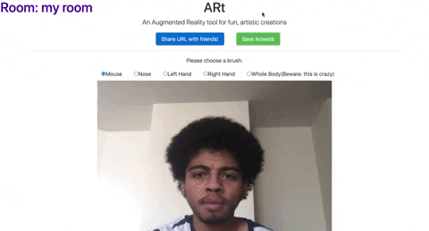

# AR[t]
An Augmented Reality tool for artistic collaboration. 
<div align="center">
    
</div>

# Documentation

## Description
For my Intro to IM final project, I wanted to delve into something I have been afraid of delving into in the past: server-side programming with Node.js. After talking with my professor, he agreed to let me take on this challenge instead of connecting Arduino and Processing ( which I proved to myself I can do in this previous <a href="https://github.com/jgarcia1599/IntrotoIM_Summer2020/tree/master/hw_June21">assignment</a>). Similar to how we were supposed to use serial communication to communicate between an Arduino microcontroller and a Processing sketch, I decided to use web sockets to communicate between a Node.js server and the clients connected to said server. As a result, I created ARt, a tool that lets artists and art enthusiasts create simple art pieces over the Internet. Inspired by a remote-first era, I envisioned a future where everything can take place online, even art! To spice it up a notch, I decided to let the users of the app use their body for artistic self expression through body pose tracking using Posenet. 


## Process and Implementation

### Processing and Posenet Side (Front-end)
The front-end of this web app is a simple processing sketch wrapped up in a DOM element that is styled using the Bootstrap Library. There is also a landing page where users can choose the room they want to join by typing the name of their desired room in the text input element. 
   
Once a user chooses a room in the landing page, the user is redirected to the painting page. In this page, in order to determine which room the user is in, I use the <a href="https://cdnjs.com/libraries/qs">querystring parser library</a> to extract the parameters from the url. For example, the follwing url: 

```
https://collart.herokuapp.com/paint.html?room=room1
```
tells us that the client has joined the room named "room1". I then send this information to the server with the following function: 

```javascript
//Join chatroom
socket.emit('join_room',room);
```
where room is the variable that contains the URL's room parameter.  This is done by using the ```socket``` variable, which is an instantiation of the socket.io library on the client side. The ```emit()``` function sends messages to the server with a name (in this case, the message name is "join_room") and some data (in this case, the room name). This pattern is then repeated for other emit messages that the client code needs to send to the server for this web app to work.  The room variable is also displayed in the html page using jquery so that the users are aware of which rooom they are in.
    
In the painting page, the background of the p5 sketch is the video feed and the drawings are rendered on top of the video feed by appending them to a graphics element.  An example of this can be seen in the following ```mousePressed()``` where an ellipse is appended to the graphics element ```pg``` based on the mouse's x and y position. 

```javascript
function mouseDragged(){
	if (user_brush =="mouse"){
		//create data element to send to server
		var data = {
			x: mouseX,
			y: mouseY,
			color: myColor,
			size: mySize
		}
		//emit data element to the server
		socket.emit('drawing', {data,room});
		//draw on the pg element the ellipse
		pg.noStroke();
		pg.fill(myColor[0], myColor[1], myColor[2]);
		pg.ellipse(mouseX, mouseY, mySize, mySize);
}
```
As seen above, not only do we need to draw on the canvas element, we also need to send it to the server so that the same drawing is reflected on the sketches of all of the clients connected to the same room. We do this using the emit function of the socket variable. 

The pose estimation aspect of this project is actually fairly simple. The Posenet library basically provides an array with all the human poses, and the probability of a pose being on the videocamera feed. As such, I basically iterate through all of the poses every single ```draw``` frame in the processing sketch, and if a specific pose is selected by a user and there is a probability of 0.2 that the pose is there, I draw an ellipse on the pose's position. This happens in the following function


```javascript
	  for (let j = 0; j < pose.keypoints.length; j++) {
		// A keypoint is an object describing a body part (like rightArm or leftShoulder)
		let keypoint = pose.keypoints[j];
		// Only draw an ellipse is the pose probability is bigger than 0.2 and if the user has chosen the pose
		if (keypoint.score > 0.2 && keypoint.part == user_brush) {
		//draw on the pg element the ellipse
		  pg.fill(myColor[0], myColor[1], myColor[2]);
		  pg.noStroke();
		  pg.ellipse(keypoint.position.x, keypoint.position.y, mySize, mySize);
		  //create data element to send to server
		  var data = {
			x: keypoint.position.x,
			y: keypoint.position.y,
			color: myColor,
			size: mySize
			};
		   //draw on the pg element the ellipse
		   socket.emit('drawing', {data,room});
		}

```
Just like in the mousePressed() example, every ellipsed drawn on the sketch is send to the server using the emit function. 

I also wanted to let users be able to download their artwork. This is done using the save function in p5.js, as seen below: 

```javascript
//function to download the canvas once a user is done.
function downloadcanvas(){
	console.log("ok lets download");
	save(pg, "art", 'png');

}
```
This functioned is called whenever the users clicks the save artwork button on the painting page. 


### Nodejs Side (Back-end)

The most difficult aspect of this project was to create a robust backend to handle all of the socket messages that are sent by the client. Although the entire server consistd of 30 lines of code, it required me to read up on node.js a lot and to watch a lot of tutorials that implement similar projects. As stated above, the clients basically send three types of socket messages: 
- connection
This is the first event handler, that basically notifies the server whenever a new user joins.
- join_room : to join a user to a specific room
This message contains the room name. The user is assigned to a room by doing the following: 

```javascript
	socket.on("join_room", room=>{
		console.log(room);
		socket.join(room);
	});
```
Very simple! When I found out how to do this, I was very happy!

- drawing : information of the ellipse being drawn within a specific room
This message receives the ellipse's data and the room the client belongs to all contained within a variable called ``` received```. This data is received by the server and then is emmited back to all of the clients connected in the same room as the client who send the message. This can be seen below: 

```javascript
	socket.on('drawing', received =>{
		console.log(received.data);
		socket.to(received.room).emit('drawing', received.data);
	});

```

## Future Improvements
As my focus was to learn more about node, I didn't implement a lot of the features artists who use my app would like. As such, after this class, I will work to implement the following:

- A color palatte UI that lets users choose the color of their brush.
- A more robust backend that lets users know who is in the room. 

If you have any recommendation, please feel free to contact me!

# To use online
- Go to this url: https://collart.herokuapp.com/
- Create a room on the landing page. 
- Share URL with your friends and start painting!

# Dependencies
- <a href="https://ml5js.org/reference/api-PoseNet/">ml5's Posenet</a> : For pose estimation using your webcam.
- <a href="https://p5js.org/">p5.js</a> : For sketch drawing.
- <a href="https://jquery.com/">Jquery</a> : For DOM manipulation.
- <a href="https://nodejs.org/en/">Node.js</a>: For server-sid programming.
    - <a href="https://socket.io/">socket.io</a>: For web socket communication between the clients and the server.
    - <a href="https://expressjs.com/">Express</a>: For easier web server creation. 

# To install and use locally
- Clone this repository.
```
git clone https://github.com/jgarcia1599/ARt.git
```
- enter directory
```
cd ARt
```
- Install node dependencies
```
npm install
```
- Start server
```
npm start
```

- Go to localhost:3000 in your browser and start painting !

# Development Practices
If you wish to expand on this project, fork this repository. I used the <a href="https://www.npmjs.com/package/nodemon">nodemon</a> module as it hot-refreshes my server every time I update it. I recommend you to do the same. 
- To use nodemon
```
nodemon server.js
```

# Resources 
- Traversy Media tutorial for web sockets: https://www.youtube.com/watch?v=jD7FnbI76Hg
- Daniel Shiffman tutorial for https://www.youtube.com/watch?v=2hhEOGXcCvg


Made with ♥ by Junior Garcia

